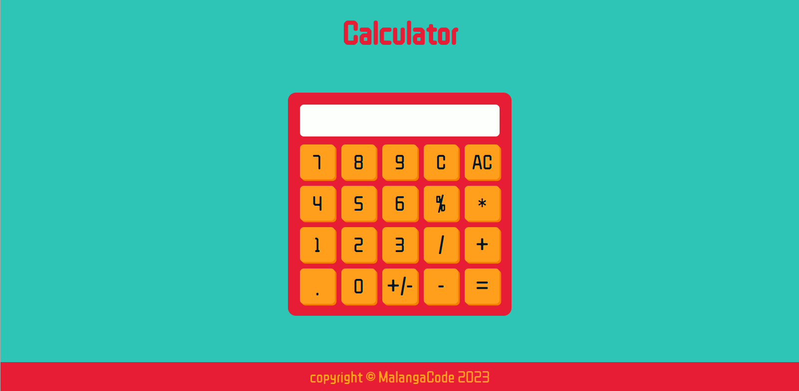

# Online calculator
This calculator allow you to perform basic arithmetic operations on numbers, whether it's positive or negative. You can use both integer and non-integer numbers.

View in [Online Calculator](https://malangacode.github.io/calculator/).

## Supported operations
* Addition
* Subtraction
* Multiplication
* Division
* Percentage
* Set positive or negative number sign

## Buttons
### (0-9) Numbers Buttons
### (\+) Addition Button
### (\-) Subtraction Button
### (\*) Multiplication Button
### (/) Division Button
### (%) Percentage Button
### (+/-) Set Number sign Button
### (C) Clear Display Button
### (A.C.) Clear Memory Button
### (.) Floating Point Button
### (=) Product Button

## Input support
It can be used by clicking on the screen buttons as well, pressing the correspondent number or operator key on the keyboard.
### Special Keys
* **C key,** corresponds to Clear Display Button.
* **Backspace key,** corresponds to Clear Memory Button.
* **Enter key,** corresponds to Product Button.
* **% key,** corresponds to Percentage Button.

**Note:** Set Number sign Button is not keyboard supported.

